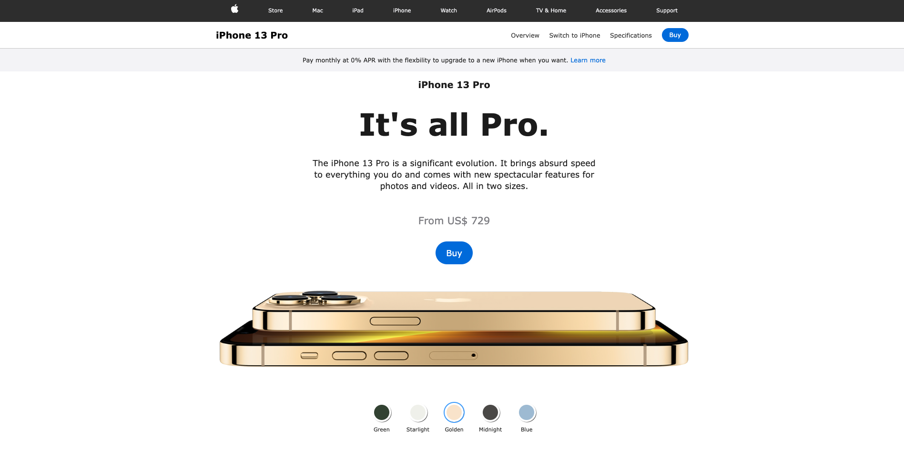

# apple-iphone-page-clone
 A clone of Apple's iPhone 13 Pro landing page, showcasing the latest features and design.

Description:
As a passionate web developer, I undertook the exciting challenge of creating a high-fidelity clone of Apple's iPhone 13 Pro landing page. This project allowed me to hone my skills in HTML, CSS, and JavaScript while meticulously replicating the user experience of Apple's website.

Project Description:

Objective: To create a pixel-perfect clone of Apple's iPhone 13 Pro landing page, complete with interactive features.
Technologies Used: HTML, CSS, JavaScript
Key Features:
Interactive color picker for different iPhone variants
Responsive design for seamless viewing on various devices
Carefully crafted user interface for an authentic Apple look and feel
Integration of navigation, product details, and a footer with legal links and social media icons
Outcome: A fully functional clone that captures the essence of Apple's product presentation while demonstrating my proficiency in web development.

 

<b>
<h3><a href="">Explore the project</a></h3>

